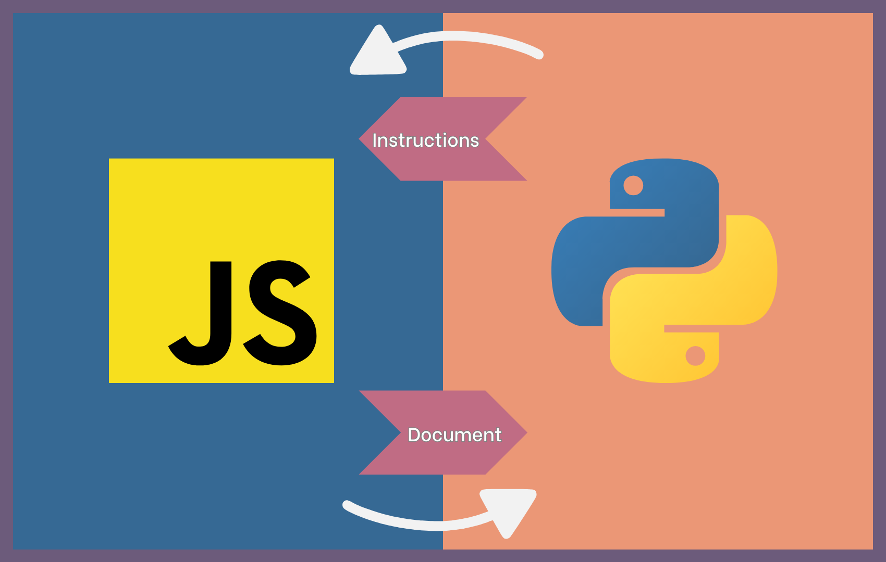

# How ToUI works

## How ToUI creates web applications
ToUI uses [Flask](https://flask.palletsprojects.com/) to create web applications. To make the website responsive, ToUI communicates
with JavaScript through WebSockets. The WebSocket communication is established using the
Python package Flask-Sock and the JavaScript object `WebSocket`. JavaScript sends the
`document` object to Python while Python sends 'instructions' back to JavaScript:

## How ToUI creates desktop apps
ToUI uses [pywebview](https://pywebview.flowrl.com/) to create graphical user interfaces
(desktop apps). The communication between Python and JavaScript is similar to web apps
but using [js_api object](https://pywebview.flowrl.com/examples/js_api.html) in pywebview
instead of WebSockets.

## Security?
For web apps, ToUI uses Flask web framework, Flask-Sock for communicating through WebSockets,
and Flask-BasicAuth for restricting access to the website. To know more about the security of
these Python packages, please find their documentations below:
- [Flask docs](https://flask.palletsprojects.com/)
- [Flask-Sock docs](https://flask-sock.readthedocs.io/en/latest/)
- [Flask-BasicAuth docs](https://flask-basicauth.readthedocs.io/en/latest/)

ToUI uses pywebview for making desktop apps. To learn more about its security, please check
this link: [pywebview docs](https://pywebview.flowrl.com/). Note that pywebview can create 
two types of apps: serverless apps or apps built by running a local web server. However, 
ToUI currently creates only serverless pywebview apps.